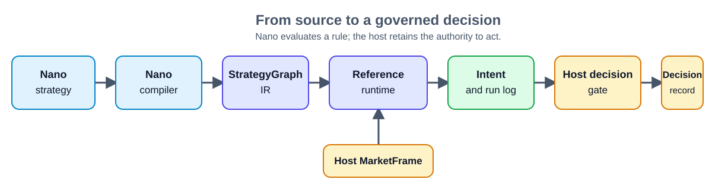

<div align="center">


# Nano

### Trading and agent rules that run the same way every time — with a receipt.

[](https://github.com/AetherAI3/Nano/actions/workflows/ci.yml)
[](LICENSE)
[](pyproject.toml)

### **[→ Browse the Strategy Library](https://aethersystems.net/nano)**

Read every strategy in this repo — source, compiled IR, signals and provenance — in
your browser. No install, no account. Open any one of them straight into an editor.

</div>

> **Write the rule in plain text. Replay any decision. Keep final authority in your application.**

Nano is a small, Python-embeddable language for transparent threshold rules. You write the rule; Nano compiles it into validated IR, evaluates it against numbers your system supplies, and returns proposed `Intent` values with an ordered run log of every step it took to get there. It does not call an exchange, API, or other external system.

```nano
strategy MaxDrawdownBreaker {
    agent RiskDesk
    every 1m {
        if DRAWDOWN >= 5 {
            pause()
        }
    }
}
```

That is the risk breaker from the [strategy library](nano/library/risk/max_drawdown_breaker.nano), with its comment header trimmed: when portfolio drawdown reaches 5 percent, propose a `PAUSE` and escalate to a named risk desk. Nano cannot halt anything by itself — your application's gate decides whether to act on the proposal. That separation is the whole design.

### Why that matters when money is on the line

- **Deterministic** — the same rule over the same inputs replays to the same decision, every time.
- **Auditable** — every run carries an ordered log you can archive, diff, or hand to someone who is asking questions.
- **Host-governed** — Nano *proposes* an intent; your system disposes. Nano cannot place an order.
- **Small** — few moving parts to audit, and it embeds in a Python stack you already have.

**Alpha reference implementation (v0.1.0).** The examples are trading-oriented, but Nano fits any system where a host supplies numeric signals and must retain control over what happens next — see [deterministic watchdogs and compliance controls](#deterministic-watchdogs-and-compliance-controls).

## Why Nano

A rule and an approval are different jobs. Nano makes the rule compact, versioned, and replayable; your application owns data quality, policy, persistence, and real-world effects. That separation makes a decision trail easier to inspect without giving a script authority over your infrastructure.

## Quick start

From a fresh checkout, run the bundled Momentum strategy and then the test suite:

```bash
git clone https://github.com/AetherAI3/Nano.git
cd Nano
python -m venv .venv

# macOS/Linux: source .venv/bin/activate
# Windows PowerShell: .venv\Scripts\Activate.ps1

python -m pip install -e ".[dev]"
python examples/momentum_demo.py
python -m pytest -q
```

The demo compiles a checked-in strategy, injects two RSI values, and produces a proposed action:

```text
BUY BTC at timestamp=300 (confidence=0.91)
```

This is the complete `.nano` program it runs:

<!-- README-EXAMPLE:START -->
```nano
strategy Momentum {
  every 5m {
    if RSI(14) < 30 {
      buy(BTC, 0.91)
    }
  }
}
```
<!-- README-EXAMPLE:END -->

`RSI(14)` is the **feed-signal form**: the host computes and injects the `RSI` series. v1.0 adds a **computed form** — `RSI(close, 14)`, where `close` is a declared `input` and Nano derives the series itself from 35 deterministic kernels. Nano still never *fetches* market data. See the [language reference](docs/language.md) for both contracts.

## Start with the strategy library

The [strategy library](nano/library/README.md) is Nano's community on-ramp: a small, tested corpus of familiar trading ideas — and deterministic watchdog controls — translated into the DSL. Every entry pairs readable `.nano` source with expected IR, so quant researchers can learn the language, compare conventions, and contribute a new rule with confidence.

**[Your first contribution →](docs/first-contribution.md)** walks the whole path once, with a real rule: idea, source, generated IR, deterministic replay, CI, pull request. One command generates the IR fixture and checks the entry before you push it.

The same corpus is browsable at **[aethersystems.net/nano](https://aethersystems.net/nano)** — search and filter by category, cadence or signal, read the source and compiled IR side by side, and open any strategy directly in an editor. Nothing to install, no account needed.

| momentum | mean_reversion | trend | volatility | volume | risk | event_volatility | watchdog |
| --- | --- | --- | --- | --- | --- | --- | --- |
| 4 rules | 3 rules | 4 rules | 2 rules | 2 rules | 7 rules | 11 rules | 2 rules |

The library is a conformance corpus, not a performance claim, live signal service, or trading recommendation.

[Browse online →](https://aethersystems.net/nano) · [Browse in-repo →](nano/library/README.md) · [Your first contribution →](docs/first-contribution.md) · [Add a strategy →](CONTRIBUTING.md#add-a-strategy) · [Propose a language change →](https://github.com/AetherAI3/Nano/issues/new?template=language-change.yml)

## From rule to governed decision



Nano owns parsing, IR validation, and deterministic reference evaluation. The host supplies the `MarketFrame`, applies its `DecisionGate`, stores the result, and performs any real-world action. The same graph and frame produce the same reference result; bridge replay is deterministic when the host gate is deterministic too.

## Small by design

| Nano provides | The host retains |
| --- | --- |
| A small strategy source format, validated `StrategyGraph` IR, and deterministic reference evaluation | Signal calculation, data quality, and scheduling |
| Named numeric signal series and AND-only threshold conditions | Policy, approvals, persistence, and external effects |
| Proposed `buy`, `sell`, `execute`, `pause`, and `observe` intents | API calls, exchange execution, and any action with consequences |

v1.0 adds static typing with `series<T>`, look-ahead protection, arithmetic and `or`/`not`, `param`/`input`/`let` declarations, computed indicators, and a CLI. It still has no LLM runtime, live data feed, or action executor — a reasoning provider is a protocol the host implements. [`docs/status.md`](docs/status.md) separates implemented behavior from experimental work and future ideas.

## Deterministic watchdogs and compliance controls

Trading is Nano's first reference domain, not its limit.

We envision Nano as a compact rule layer for **deterministic watchdog agents**: small, continuously evaluated programs that inspect host-provided signals, identify a policy condition, and propose a bounded response. A watchdog can recommend that an operation proceed, pause, or receive additional review, but it cannot perform the operation itself.

In this model, "agent" does not mean an autonomous AI process. A Nano watchdog is:

- versioned;
- deterministic;
- restricted to declared inputs;
- replayable from the same input frame;
- unable to fetch data or call external systems; and
- subordinate to a host-controlled decision gate.

The host remains responsible for collecting trustworthy signals, deciding whether the rule is authorized for use, recording the result, and carrying out any real-world effect.

### Security watchdogs

A security system could provide Nano with numeric state such as:

- whether a trusted network route is available;
- the number of unsigned artifacts in a release;
- authentication failures within a bounded interval;
- the age of a credential or signing key;
- the number of endpoints outside an approved posture;
- whether a required security control is currently verified; or
- the severity and confidence of a host-generated finding.

A watchdog could then produce a proposed `PAUSE`, `OBSERVE`, or other supported intent for the host to evaluate.

For example, a host could represent trusted-route availability as `1` or `0`:

```nano
strategy TrustedRouteWatchdog {
  every 1m {
    if TRUSTED_ROUTE < 1 {
      pause()
      observe()
    }
  }
}
```

Nano does not inspect the network, disable traffic, or decide that a network is hostile. The host measures the route state and supplies `TRUSTED_ROUTE`. Nano only evaluates the declared threshold and returns proposed intents with an ordered execution log.

Working versions of these rules live in [`nano/library/watchdog/`](nano/library/watchdog/), alongside the signal conventions a host has to implement — see [the category's section in the library README](nano/library/README.md#watchdog-signals-watchdog). Contributing one follows the [same path as a strategy](docs/first-contribution.md).

The application's gate can then consider additional context, require operator consent, reject the proposal, or authorize an independently implemented enforcement mechanism.

### Compliance as executable, replayable policy

Compliance rules are often distributed across prose, dashboards, scripts, ticket approvals, and undocumented operational knowledge. Nano can provide a narrow way to express the measurable portion of a control as versioned source.

Potential applications include:

- requiring a minimum number of approvals before a release;
- holding deployment when unresolved critical findings exceed a threshold;
- checking credential age against an organizational limit;
- detecting configuration or access-policy drift;
- enforcing transaction or exposure limits;
- verifying that required controls reported healthy before a sensitive operation;
- checking retention, residency, or review-state signals supplied by a host; and
- generating repeatable evidence for internal or external audits.

An illustrative release rule might be:

```nano
strategy ReleaseCompliance {
  every 5m {
    if CRITICAL_FINDINGS > 0 and APPROVED_REVIEWERS < 2 {
      pause()
      observe()
    }
  }
}
```

The host determines what counts as a critical finding, how reviewer approval is verified, and what `pause()` means in that environment. Nano does not connect to CI, modify a deployment, or approve a release.

### From policy text to audit evidence

For every evaluation, a host integration can preserve:

1. the original `.nano` source;
2. the validated and versioned `StrategyGraph`;
3. the exact host-provided input frame;
4. the ordered Nano execution log;
5. the proposed intents;
6. the host gate's final decision; and
7. any separately authorized external action.

This creates a useful separation between three questions:

- What condition did the rule evaluate?
- What did the rule propose?
- What did the host ultimately authorize?

Because those stages remain distinct, a team can replay an incident or audit decision without granting the rule authority over infrastructure.

### Explainable automation without autonomous authority

A reasoning model may help an operator write a rule, summarize a run log, or explain why a threshold matched. It should not silently change the validated strategy, manufacture input values, or bypass the host gate.

The intended pattern is:

```
host observations
       ↓
validated Nano rule
       ↓
deterministic proposal + ordered log
       ↓
host policy and authorization gate
       ↓
optional external effect
```

This architecture makes Nano suitable for environments where automation is valuable but unbounded autonomy is not: security operations, infrastructure governance, financial controls, software release management, privacy systems, and regulated workflows.

### Current status

Nano v0.1.0 provides the small scheduled-threshold foundation used by these examples. Broader watchdog and compliance deployments require host integrations, domain-specific signal contracts, durable persistence, authorization gates, and security review.

Nano itself remains intentionally narrow: it evaluates declared rules and proposes intents. The host observes the world, owns the policy boundary, and performs any action with consequences.

## Build with Nano

Nano stays approachable by keeping its contract narrow and changes reviewable. Contributions are welcome from:

- **Quant researchers** who can add a strategy and document its signal convention.
- **Application engineers** who can improve integrations, replay coverage, documentation, or developer experience.
- **Language contributors** who can start a focused proposal before changing grammar or IR.

See [CONTRIBUTING.md](CONTRIBUTING.md) for the contribution workflow and the [issue templates](.github/ISSUE_TEMPLATE/) for a clear place to begin.

## Documentation

| Need | Start here |
| --- | --- |
| Explore or contribute a strategy | [Strategy library](nano/library/README.md) |
| Learn the grammar and runtime semantics | [Language reference](docs/language.md) |
| Understand module boundaries | [Architecture](docs/architecture.md) |
| Check implemented versus experimental work | [Status](docs/status.md) |
| Integrate or contribute | [Contributing](CONTRIBUTING.md) |
| Report a security concern | [Security policy](SECURITY.md) |

The [paper series](docs/papers/README.md) records design arguments and research directions; source and tests define current behavior.
